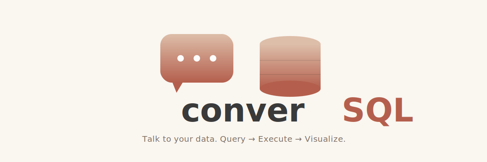

<p align="center">
   
</p>

# converSQL


> Transform natural language questions into production-ready SQL with ontological context and warm, human-centered design.

## Why converSQL

### The challenge
- Business teams wait on backlogs of custom SQL while analysts juggle endless report tweaks.
- Complex domains like mortgage analytics demand institutional knowledge that traditional BI tools cannot encode.
- Open data is abundant, but combining it with AI safely and accurately remains tedious.

### Our approach
- **Ontology-first modeling** captures relationships, risk logic, and business vocabulary once and reuses it everywhere.
- **Adapter-based AI orchestration** lets you swap Claude, Bedrock, Gemini, or local engines without touching the UI.
- **Streamlit experience design** bridges analysts and executives with curated prompts, cached schemas, and explainable results.

## Flagship implementation: Single Family Loan Analytics
The reference app ships with 9M+ rows of Fannie Mae loan performance data. Ask the AI for “high-risk California loans under 620 credit score” and get DuckDB-ready SQL plus rich metrics at a glance.

### Spotlight features
- 🧠 110+ fields grouped into 15 ontology domains with risk heuristics baked into prompts.
- ⚡ CSV ➜ Parquet pipeline with enforced types, 10× compression, and predicate pushdown via DuckDB.
- 🔐 Google OAuth guardrails with optional Cloudflare D1 logging.
- 🤖 Multi-provider AI adapters (Bedrock, Claude, Gemini) with graceful fallbacks and prompt caching.

```sql
SELECT LOAN_ID, STATE, CSCORE_B, OLTV, DTI, DLQ_STATUS, CURRENT_UPB
FROM data
WHERE STATE = 'CA'
  AND CSCORE_B < 620
  AND CSCORE_B IS NOT NULL
ORDER BY CSCORE_B ASC, OLTV DESC
LIMIT 20;
```

## Architecture at a glance
```
Streamlit UI (app.py)
 └─ Core orchestration (src/core.py)
     ├─ DuckDB execution
     ├─ Cached schema + ontology context
     └─ Data sync checks (scripts/sync_data.py)
 └─ AI service (src/ai_service.py)
     ├─ Adapter registry (src/ai_engines/*)
     ├─ Prompt construction with risk framework
     └─ Clean SQL post-processing
```

## 🏗️ Architecture

converSQL follows a clean, layered architecture designed for extensibility:

```
┌─────────────────────────────────────────────────────────────┐
│                     Application Layer                        │
│  (Streamlit UI • Query Builder • Ontology Explorer)         │
└────────────────────────┬────────────────────────────────────┘
                         │
┌────────────────────────┴────────────────────────────────────┐
│                      AI Engine Layer                         │
│  (Adapter Pattern: Bedrock • Claude • Gemini • Ollama)      │
└────────────────────────┬────────────────────────────────────┘
                         │
┌────────────────────────┴────────────────────────────────────┐
│                   Intelligence Layer                         │
│  (Ontology • Schema Context • Business Rules)               │
└────────────────────────┬────────────────────────────────────┘
                         │
┌────────────────────────┴────────────────────────────────────┐
│                      Data Layer                              │
│  (Parquet Files • DuckDB • R2 Storage • Query Execution)    │
└─────────────────────────────────────────────────────────────┘
```

### The Data Engineering Pipeline

Our showcase implementation demonstrates a complete data engineering workflow:

1. **Ingestion**: Fannie Mae's pipe-separated loan performance files
2. **Transformation**: Schema enforcement with explicit data types (VARCHAR, Float, Int16, etc.)
3. **Storage**: Parquet format with SNAPPY compression (10x size reduction)
4. **Performance**: DuckDB for blazing-fast analytical queries
5. **Ontology**: Structured metadata linking business concepts to database schema

📄 **[Learn more about the data pipeline →](docs/DATA_PIPELINE.md)**

## Brand palette
| Token | Hex | Description |
| --- | --- | --- |
| `--color-background` | `#FAF6F0` | Ivory linen canvas across the app |
| `--color-background-alt` | `#FDFDFD` | Porcelain surfaces for cards and modals |
| `--color-text-primary` | `#3A3A3A` | Charcoal Plum headings |
| `--color-text-secondary` | `#7C6F64` | Warm Taupe body copy |
| `--color-accent-primary` | `#DDBEA9` | Soft Clay primary accent |
| `--color-accent-primary-darker` | `#B45F4D` | Terracotta hover and emphasis |
| `--color-border-light` | `#E4C590` | Gold Sand borders, dividers, and tags |

## Quick start
1. **Install prerequisites**
   ```bash
   git clone https://github.com/ravishan16/converSQL.git
   cd converSQL
   pip install -r requirements.txt
   ```
2. **Configure environment**
   ```bash
   cp .env.example .env
   # Enable one AI block (CLAUDE_API_KEY, AWS_* for Bedrock, or GEMINI_API_KEY)
   # Provide Google OAuth or set ENABLE_AUTH=false for local dev
   ```
3. **Launch the app**
   ```bash
   streamlit run app.py
   ```

## Key documentation
- [Architecture](docs/ARCHITECTURE.md) – layered design and component interactions.
- [Data pipeline](docs/DATA_PIPELINE.md) – ingest, transformation, and Parquet strategy.
- [AI engines](docs/AI_ENGINES.md) – adapter contracts and extension guides.
- [Environment setup](docs/ENVIRONMENT_SETUP.md) – required variables for auth, data, and providers.

## Developer workflow
- `make setup` – clean install + cache purge.
- `make test-unit` / `make test` – pytest with coverage that mirrors CI.
- `make format` and `make lint` – Black (120 cols), isort, flake8, mypy.
- Cached helpers such as `scan_parquet_files()` trigger `scripts/sync_data.py` when Parquet is missing—keep `data/processed/` warm during tests.

## Contributing
1. Fork and branch: `git checkout -b feature/my-update`.
2. Run formatting + tests before committing.
3. Open a PR describing the change, provider credentials (if applicable), and test strategy.

See [CONTRIBUTING.md](CONTRIBUTING.md) for templates, AI adapter expectations, and review checklists.

## Broader use cases
- **Financial services** – credit risk, portfolio concentrations, regulatory stress tests.
- **Healthcare** – patient outcomes, clinical trial cohorts, claims analytics.
- **E-commerce** – customer segments, inventory velocity, supply chain exceptions.
- **Any ontology-driven domain** – define your schema metadata and let converSQL converse.

## Roadmap snapshot
- ✅ Multi-AI adapter support with prompt caching and fallbacks.
- ✅ Mortgage analytics reference implementation.
- 🔄 Ollama adapter and enhanced SQL validation.
- 🔮 Upcoming: multi-table joins, query explanations, historical learning, self-serve ontology editor.

## License
Released under the [MIT License](LICENSE).

## Acknowledgments
- Fannie Mae for the Single Family Loan Performance dataset.
- The DuckDB, Streamlit, and Anthropic/AWS/Google teams for exceptional tooling.
- The converSQL community for ideas, issues, and adapters.

## Stay connected
- ⭐ Star the repo to follow releases.
- 💬 Join discussions or open issues at [github.com/ravishan16/converSQL/issues](https://github.com/ravishan16/converSQL/issues).
- 📨 Share what you build—data should feel conversational.