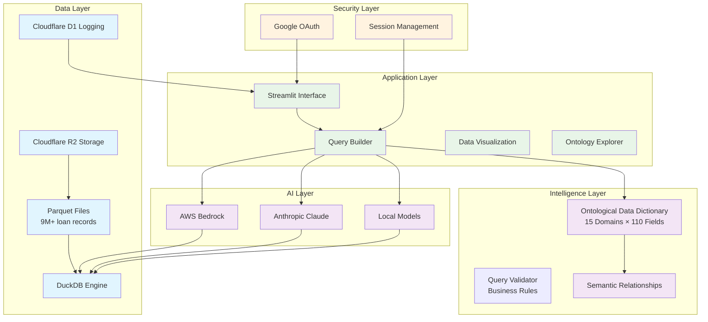

# Conversational SQL

**Conversational SQL** is an open-source framework for transforming natural language questions into powerful SQL queries for any tabular dataset. It’s designed for developers, data scientists, and teams who want to build AI-powered analytics tools with minimal effort.

## 🚀 Why Conversational SQL?

Stop writing complex SQL by hand! With Conversational SQL, you can:
- Ask questions in plain English and get optimized SQL instantly
- Integrate with multiple AI providers (Anthropic Claude, AWS Bedrock, local models)
- Extend to any domain with ontological data modeling
- Build interactive dashboards, query builders, and analytics apps

## 🏆 Flagship Use Case: Single Family Loan Analytics

This repo features a production-grade implementation for mortgage loan portfolio analysis. It’s a showcase of how Conversational SQL can power real-world, domain-specific analytics.

**Key Features:**
- **Natural Language to SQL**: "Show me high-risk loans in California" → SQL
- **Ontological Intelligence**: 110+ fields, 15 business domains, semantic relationships
- **Real-time Analytics**: Dashboards, metrics, risk indicators
- **Multi-Provider AI**: Anthropic Claude, AWS Bedrock, local models
- **Cloudflare D1 Logging**: All user logins and queries are securely logged using Cloudflare D1 (no external DB required)


## 🧠 How Ontology Improves SQL Generation

Conversational SQL uses an ontological approach to bridge the gap between natural language and complex, domain-specific SQL. This enables:

- **Accurate mapping of business terms to data fields**
- **Automatic handling of semantic relationships and business rules**
- **Consistent, explainable query generation for analytics and reporting**

**Examples:**

- *Domain-Aware Context*: Instead of "Show loans in bad condition," the ontology maps this to `DLQ_STATUS = '03'` (90+ days delinquent).
- *Semantic Relationships*: "High-risk borrowers" automatically includes:
    - `CSCORE_B < 620` (credit quality)
    - `OLTV > 95%` (equity position)
    - `DTI > 43%` (payment capacity)
- *Business Intelligence Integration*: "Portfolio concentration risk" generates:
    ```sql
    SELECT STATE, SUM(CURRENT_UPB)/1000000 as UPB_MM,
           COUNT(*) as loan_count,
           SUM(CURRENT_UPB)/(SELECT SUM(CURRENT_UPB) FROM data)*100 as pct_portfolio
    FROM data GROUP BY STATE HAVING pct_portfolio > 15
    ```

## 🏗️ Architecture



## �️ Quick Start

### Prerequisites
- Python 3.11+
- Google OAuth credentials
- AI Provider (Claude API or AWS Bedrock)
- Cloudflare R2 or local data storage

### Installation
```bash
git clone <repository-url>
cd nlptosql
pip install -r requirements.txt
```

### Configuration
```bash
# Copy environment template
cp .env.example .env

# Configure your settings
# See setup guides for detailed instructions
```

### Launch
```bash
streamlit run app.py
```


## 📖 Developer Setup Guides

All setup and deployment guides are located in the `docs/` directory:

- **[Google OAuth Setup](docs/GOOGLE_OAUTH_SETUP.md)** — Authentication configuration
- **[Cloud Storage Setup](docs/R2_SETUP.md)** — Cloudflare R2 data storage configuration
- **[Cloudflare D1 Setup](docs/D1_SETUP.md)** — Logging user activity with Cloudflare D1
- **[Environment Setup](docs/ENVIRONMENT_SETUP.md)** — Environment variables and dependencies
- **[Deployment Guide](docs/DEPLOYMENT.md)** — Deploy to Streamlit Cloud or locally


## 💡 Extending Conversational SQL

Conversational SQL is designed for easy adaptation to any tabular dataset. To use it for your own data, simply swap out the ontology and schema files for your domain.


## 🎯 Example Use Cases

- **Portfolio Risk Management**: "Show me all loans in Florida with FICO scores below 620"
- **Performance Analytics**: "What's the delinquency rate by vintage year for California loans?"
- **Concentration Risk**: "Which states have more than 15% of our portfolio?"
- **Credit Quality Assessment**: "Compare average DTI and LTV by credit score tier"

## 🤝 Contributing

We welcome contributions! Please see our contributing guidelines for code standards, testing requirements, and the pull request process.

## 📄 License

This project is licensed under the MIT License - see the LICENSE file for details.

---

**Built with:** Python • Streamlit • DuckDB • AWS Bedrock • Anthropic Claude • Google OAuth • Cloudflare R2 • Cloudflare D1