# Single Family Loan Analytics Platform

Transform natural language questions into powerful SQL queries for mortgage loan portfolio analysis using AI-powered ontology-driven intelligence.

## 🎯 What This Does

This platform enables mortgage analysts and data scientists to query millions of loan records using plain English, automatically generating precise SQL through an ontological data model that understands mortgage finance domain knowledge.

**Key Capabilities:**
- **Natural Language to SQL**: Ask questions like "Show me high-risk loans in California" → Get optimized SQL
- **Ontological Intelligence**: 110+ data fields organized across 15 business domains with semantic relationships
- **Real-time Analytics**: Interactive dashboards with loan performance metrics and risk indicators
- **Multi-Provider AI**: Support for AWS Bedrock, Anthropic Claude, and local models

## 🧠 How Ontology Improves SQL Generation

Traditional NL-to-SQL systems struggle with domain-specific terminology and field relationships. Our ontological approach:

### 1. **Domain-Aware Context**
```
Instead of: "Show loans in bad condition"
Ontology understands: DLQ_STATUS = '03' (90+ days delinquent)
```

### 2. **Semantic Relationships**
```
"High-risk borrowers" automatically includes:
- CSCORE_B < 620 (credit quality)
- OLTV > 95% (equity position)
- DTI > 43% (payment capacity)
```

### 3. **Business Intelligence Integration**
```
"Portfolio concentration risk" generates:
SELECT STATE, SUM(CURRENT_UPB)/1000000 as UPB_MM,
       COUNT(*) as loan_count,
       SUM(CURRENT_UPB)/(SELECT SUM(CURRENT_UPB) FROM data)*100 as pct_portfolio
FROM data GROUP BY STATE HAVING pct_portfolio > 15
```

## 🏗️ Architecture

```mermaid
graph TB
    subgraph "Data Layer"
        R2[Cloudflare R2 Storage]
        PQ[Parquet Files<br/>9M+ loan records]
        DUCK[DuckDB Engine]
    end

    subgraph "Intelligence Layer"
        ONT[Ontological Data Dictionary<br/>15 Domains × 110 Fields]
        VAL[Query Validator<br/>Business Rules]
        REL[Semantic Relationships]
    end

    subgraph "AI Layer"
        BED[AWS Bedrock]
        CLA[Anthropic Claude]
        LOC[Local Models]
    end

    subgraph "Application Layer"
        UI[Streamlit Interface]
        QRY[Query Builder]
        VIZ[Data Visualization]
        EXP[Ontology Explorer]
    end

    subgraph "Security Layer"
        AUTH[Google OAuth]
        SESS[Session Management]
    end

    R2 --> PQ
    PQ --> DUCK
    ONT --> REL

    UI --> QRY
    QRY --> ONT
    QRY --> BED & CLA & LOC
    BED & CLA & LOC --> DUCK

    AUTH --> UI
    SESS --> QRY

    classDef dataNodes fill:#e1f5fe
    classDef aiNodes fill:#f3e5f5
    classDef appNodes fill:#e8f5e8
    classDef secNodes fill:#fff3e0

    class R2,PQ,DUCK dataNodes
    class ONT,REL,BED,CLA,LOC aiNodes
    class UI,QRY,VIZ,EXP appNodes
    class AUTH,SESS secNodes
```



## 🚀 Core Components

### **1. Ontological Data Dictionary**
- **15 Business Domains**: Identification, Temporal, Credit Risk, Geographic, etc.
- **110+ Field Mappings**: Complete mortgage loan lifecycle coverage
- **Semantic Relationships**: Credit triangle (Credit + Collateral + Capacity)
- **Risk Intelligence**: Built-in risk tiers and business rules

### **2. AI-Powered Query Engine**
- **Multi-Provider Support**: AWS Bedrock (Claude, Titan), Anthropic Claude API
- **Context-Aware Generation**: Domain knowledge + field relationships + business rules
- **Query Validation**: Syntax checking, field validation, performance optimization
- **Natural Language Processing**: Complex financial terminology understanding

### **3. Interactive Analytics Interface**
- **Query Builder**: Natural language input with AI-powered SQL generation
- **Ontology Explorer**: Interactive data model navigation
- **Advanced SQL Editor**: Direct query access with schema reference
- **Real-time Results**: Sub-second query execution on 9M+ records

### **4. Secure Access**
- **Authentication**: Google OAuth integration
- **Session Management**: Secure session handling
- **Data Privacy**: No PII storage, secure cloud storage
- **Query Tracking**: Session-based query history

## 📊 Data Overview

- **Records**: 9+ million individual loan performance observations
- **Time Range**: 1999-2025 loan originations with monthly updates
- **Coverage**: All 50 states + DC, $12.4 trillion original UPB
- **Performance**: 0.3% lifetime loss rate, 98% current payment rate
- **Storage**: Optimized Parquet format for high-performance analytics

## 🚀 Quick Start

### Prerequisites
- Python 3.11+
- Google OAuth credentials
- AI Provider (Claude API or AWS Bedrock)
- Cloudflare R2 or local data storage

### Installation
```bash
git clone <repository-url>
cd nlptosql
pip install -r requirements.txt
```

### Configuration
```bash
# Copy environment template
cp .env.example .env

# Configure your settings
# See setup guides for detailed instructions
```

### Launch
```bash
streamlit run app.py
```

## 📖 Setup Guides

**Essential Setup Documentation:**

- **[🔐 Google OAuth Setup](GOOGLE_OAUTH_SETUP.md)** - Authentication configuration
- **[☁️ Cloud Storage Setup](docs/R2_SETUP.md)** - Cloudflare R2 data storage configuration
- **[🚀 Deployment Guide](docs/DEPLOYMENT.md)** - Production deployment instructions
- **[⚙️ Environment Setup](docs/ENVIRONMENT_SETUP.md)** - Development environment configuration

## 🎯 Use Cases

**Portfolio Risk Management**
```
"Show me all loans in Florida with FICO scores below 620"
→ Geographic + credit risk analysis
```

**Performance Analytics**
```
"What's the delinquency rate by vintage year for California loans?"
→ Temporal + geographic performance trending
```

**Concentration Risk**
```
"Which states have more than 15% of our portfolio?"
→ Geographic concentration analysis
```

**Credit Quality Assessment**
```
"Compare average DTI and LTV by credit score tier"
→ Multi-dimensional credit risk profiling
```

## 🤝 Contributing

We welcome contributions! Please see our contributing guidelines for code standards, testing requirements, and the pull request process.

## 📄 License

This project is licensed under the MIT License - see the LICENSE file for details.

---

**Built with:** Python • Streamlit • DuckDB • AWS Bedrock • Anthropic Claude • Google OAuth • Cloudflare R2