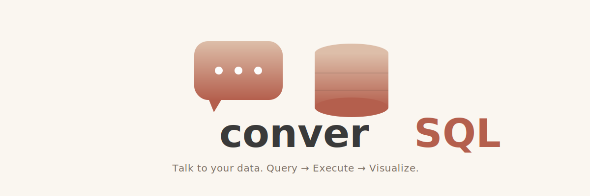

# Visualization Layer

<p align="center">
    
</p>

## Overview

The visualization layer in converSQL provides **intelligent, interactive data visualizations** that automatically adapt to your query results. Built with Altair, it offers a declarative approach to creating insightful charts with minimal configuration.

---

## Features

### 🎯 Automatic Chart Recommendations

The system analyzes your DataFrame's schema and **automatically suggests the most appropriate chart type**:

- **Time Series Data** (datetime + numeric) → Line Chart
- **Categorical Data** (category + numeric) → Bar Chart  
- **Two Numeric Columns** → Scatter Plot
- **Multiple Numeric Columns** → Heatmap
- **Single Numeric Column** → Histogram

### 📊 Supported Chart Types

| Chart Type | Best For | Example Use Case |
|------------|----------|------------------|
| **Bar Chart** | Comparing categories | Loan counts by credit tier |
| **Line Chart** | Trends over time | Interest rates by vintage |
| **Scatter Plot** | Correlations | LTV vs DTI relationship |
| **Histogram** | Distributions | Distribution of FICO scores |
| **Heatmap** | Multi-dimensional | Delinquency rates by state & year |

### 🎨 Interactive Controls

- **Chart Type Selector**: Choose from 5 chart types
- **X-axis Selector**: Pick any column for horizontal axis
- **Y-axis Selector**: Pick numeric column for vertical axis (hidden for histograms)
- **Color/Group By**: Optional categorical grouping

### 🛡️ Robust Error Handling

- **Safe Defaults**: Handles single-column DataFrames without crashing
- **Graceful Degradation**: Shows helpful messages when chart generation fails
- **Dynamic UI**: Controls adapt to selected chart type (e.g., histogram hides Y-axis)
- **Validation**: Prevents incompatible column selections

---

## Architecture

### Component Structure

```
src/visualization.py
├── render_visualization()    # Main entry point - renders UI and chart
├── make_chart()              # Chart factory - creates Altair chart objects
├── get_chart_recommendation()# Recommendation engine - analyzes DataFrame
└── _get_safe_index()         # Utility - safe index lookup with fallback
```

### Data Flow

```
Query Results (DataFrame)
    │
    ▼
┌─────────────────────────────┐
│ render_visualization()       │
│ - Analyze schema             │
│ - Show recommendation        │
│ - Render controls            │
└──────────┬──────────────────┘
           │
           ▼
┌─────────────────────────────┐
│ get_chart_recommendation()   │
│ - Detect column types        │
│ - Apply heuristics           │
│ - Return (type, x, y)        │
└──────────┬──────────────────┘
           │
           ▼
┌─────────────────────────────┐
│ make_chart()                 │
│ - Apply chart config         │
│ - Add encodings              │
│ - Return Altair chart        │
└──────────┬──────────────────┘
           │
           ▼
┌─────────────────────────────┐
│ Streamlit Display            │
│ - st.altair_chart()          │
│ - Responsive width           │
│ - Interactive tooltips       │
└─────────────────────────────┘
```

---

## Usage

### Basic Usage

The visualization layer is automatically invoked after query results are displayed:

```python
# In app.py
def display_results(result_df, title, execution_time):
    # ... display metrics and dataframe ...
    
    # Render visualization with unique key
    render_visualization(result_df, container_key=title.lower().replace(" ", "_"))
```

### Function Reference

#### `render_visualization(df, container_key="default")`

Main entry point for rendering visualizations.

**Parameters**:
- `df` (pd.DataFrame): The data to visualize
- `container_key` (str): Unique identifier for this visualization instance (enables multiple visualizations on one page)

**Returns**: None (renders directly to Streamlit)

**Example**:
```python
render_visualization(query_results, container_key="ai_query_results")
```

---

#### `make_chart(df, chart_type, x, y=None, color=None)`

Create an Altair chart object.

**Parameters**:
- `df` (pd.DataFrame): Source data
- `chart_type` (str): One of "Bar", "Line", "Scatter", "Histogram", "Heatmap"
- `x` (str): Column name for x-axis
- `y` (str, optional): Column name for y-axis (not required for Histogram)
- `color` (str, optional): Column name for color encoding

**Returns**: `alt.Chart` object or `None` if error

**Example**:
```python
chart = make_chart(df, "Bar", x="credit_tier", y="loan_count", color="vintage_period")
if chart:
    st.altair_chart(chart, use_container_width=True)
```

---

#### `get_chart_recommendation(df)`

Analyze DataFrame and recommend optimal visualization.

**Parameters**:
- `df` (pd.DataFrame): DataFrame to analyze

**Returns**: Tuple of `(chart_type: str | None, x_axis: str | None, y_axis: str | None)`

**Example**:
```python
chart_type, x, y = get_chart_recommendation(df)
if chart_type:
    print(f"Recommended: {chart_type} chart with x={x}, y={y}")
```

**Recommendation Logic**:
```python
# Time series data
if datetime_cols and numeric_cols:
    return "Line", datetime_cols[0], numeric_cols[0]

# Categorical + numeric
elif categorical_cols and numeric_cols:
    return "Bar", categorical_cols[0], numeric_cols[0]

# Two numeric columns
elif len(numeric_cols) == 2:
    return "Scatter", numeric_cols[0], numeric_cols[1]

# Many numeric columns
elif len(numeric_cols) > 2:
    return "Heatmap", numeric_cols[0], numeric_cols[1]

# Single numeric column
elif len(numeric_cols) == 1:
    return "Histogram", numeric_cols[0], None
```

---

## Chart Configuration

### Chart Type Definitions

The system uses a configuration dictionary for maintainability:

```python
CHART_CONFIGS = {
    "Bar": {"mark": "bar", "requires_y": True},
    "Line": {"mark": "line", "requires_y": True},
    "Scatter": {"mark": "circle", "requires_y": True},
    "Histogram": {"mark": "bar", "requires_y": False},
    "Heatmap": {"mark": "rect", "requires_y": True},
}
```

**Adding a New Chart Type**:

1. Add configuration to `CHART_CONFIGS`
2. Implement chart creation logic in `make_chart()`
3. Update recommendation logic in `get_chart_recommendation()` if needed
4. Add tests

Example - Adding a Box Plot:
```python
# Step 1: Add config
CHART_CONFIGS["Box"] = {"mark": "boxplot", "requires_y": True}

# Step 2: Add to make_chart()
elif chart_type == "Box":
    chart = alt.Chart(df).mark_boxplot().encode(x=x, y=y)

# Step 3: Update recommendations (if needed)
# Step 4: Add test case
```

---

## State Management

### The Problem: Disappearing Visualizations

Streamlit reruns the entire script on every interaction. Without proper key management, widget states can conflict, causing visualizations to disappear when controls change.

### The Solution: Unique Keys

Each visualization control uses a **unique key** based on the `container_key` parameter:

```python
st.selectbox(
    "Chart type",
    options,
    key=f"chart_type_{container_key}"  # ✅ Unique per visualization
)
```

This ensures:
- Multiple visualizations can coexist on the same page
- State changes don't interfere with each other
- Visualizations persist through control updates

### Best Practices

1. **Always provide container_key**: Use a descriptive identifier
   ```python
   render_visualization(df, container_key="portfolio_overview")
   ```

2. **Use title-based keys**: In display_results, derive from title
   ```python
   render_visualization(df, container_key=title.lower().replace(" ", "_"))
   ```

3. **Avoid hardcoded keys**: They cause conflicts with multiple instances

---

## Error Handling

### Edge Cases Handled

1. **Empty DataFrame**
   ```python
   if df.empty:
       st.info("No data available to visualize")
       return
   ```

2. **Single Column DataFrame**
   ```python
   # Safe Y-axis default (won't crash with index=1 on single column)
   y_index = _get_safe_index(options, y_axis, min(1, len(options) - 1))
   ```

3. **Incompatible Column Selection**
   ```python
   try:
       chart = make_chart(df, chart_type, x, y, color)
       if chart:
           st.altair_chart(chart, use_container_width=True)
   except Exception as e:
       st.error(f"Failed to generate chart: {str(e)}")
       st.info("💡 Try selecting different columns or chart type")
   ```

4. **Missing Recommendations**
   ```python
   chart_type, x, y = get_chart_recommendation(df)
   if chart_type:
       st.caption(f"💡 Recommended: **{chart_type}** chart")
   # Gracefully continue even if no recommendation
   ```

### Debugging Tips

**Problem**: Visualization disappears when changing controls

**Solution**: Check for missing or duplicate keys
```python
# ❌ Bad: No key
st.selectbox("Chart type", options)

# ✅ Good: Unique key
st.selectbox("Chart type", options, key=f"chart_type_{container_key}")
```

**Problem**: Index out of bounds error

**Solution**: Use `_get_safe_index()` helper
```python
# ❌ Bad: Direct indexing
index = options.index(value) if value else 1  # Crashes if len(options) == 1

# ✅ Good: Safe indexing
index = _get_safe_index(options, value, default=1)
```

---

## Integration with converSQL

### Display Flow

```python
# app.py - display_results()

# 1. Show query results table
st.dataframe(result_df, use_container_width=True, height=height)

# 2. Render visualization immediately after
render_visualization(result_df, container_key=title.lower().replace(" ", "_"))
```

### Styling Consistency

Visualizations automatically inherit Streamlit's theme and align with the results table:

- **Width**: `use_container_width=True` matches table width
- **Spacing**: `st.markdown("---")` separator for visual clarity
- **Colors**: Altair default theme integrates with Streamlit
- **Height**: Fixed at 400px for consistency

### Layout Structure

```
┌──────────────────────────────────────┐
│ Query Results Card                    │
│ ┌──────────────────────────────────┐ │
│ │ Performance Metrics              │ │
│ ├──────────────────────────────────┤ │
│ │ DataTable (full width)           │ │
│ ├──────────────────────────────────┤ │
│ │ Visualization                    │ │
│ │ ┌──────────────────────────────┐ │ │
│ │ │ Controls (Chart Type, Axes) │ │ │
│ │ ├──────────────────────────────┤ │ │
│ │ │ Altair Chart (responsive)    │ │ │
│ │ └──────────────────────────────┘ │ │
│ └──────────────────────────────────┘ │
└──────────────────────────────────────┘
```

---

## Examples

### Example 1: Loan Counts by Credit Tier

**Query Result**:
| credit_tier | loan_count |
|-------------|------------|
| Super Prime | 275890     |
| Prime       | 86489      |
| Near Prime  | 25018      |
| Subprime    | 491        |

**Recommendation**: Bar chart (1 categorical + 1 numeric)

**Generated Chart**:
```python
alt.Chart(df).mark_bar().encode(
    x="credit_tier",
    y="loan_count"
).properties(width="container", height=400)
```

---

### Example 2: Interest Rate Trends Over Time

**Query Result**:
| vintage_period | avg_orig_rate |
|----------------|---------------|
| Rising Rate 2022+ | 6.58       |
| Rising Rate 2022+ | 6.72       |
| Rising Rate 2022+ | 6.85       |

**Recommendation**: Line chart (datetime + numeric)

**Generated Chart**:
```python
alt.Chart(df).mark_line().encode(
    x="vintage_period",
    y="avg_orig_rate"
).properties(width="container", height=400)
```

---

### Example 3: LTV vs DTI Scatter Plot

**Query Result**:
| current_ltv | dti_pct |
|-------------|---------|
| 99.67       | 0.33    |
| 99.39       | 0.61    |
| 99.05       | 0.95    |

**Recommendation**: Scatter plot (2 numeric columns)

**Generated Chart**:
```python
alt.Chart(df).mark_circle().encode(
    x="current_ltv",
    y="dti_pct"
).properties(width="container", height=400)
```

---

## Performance Considerations

### Efficient Rendering

1. **Lazy Execution**: Charts only generated when data changes
2. **Altair Optimization**: Declarative specs compiled to Vega-Lite
3. **Data Sampling**: For very large datasets (>5000 rows), Altair automatically samples
4. **Responsive Charts**: `width="container"` uses CSS instead of recalculating dimensions

### Large Dataset Handling

Altair has a **5000 row limit** by default. For larger datasets:

```python
# Option 1: Raise limit (use cautiously)
alt.data_transformers.enable('default', max_rows=10000)

# Option 2: Sample data
if len(df) > 5000:
    df_sample = df.sample(5000)
    st.info("📊 Showing sample of 5000 rows")
    chart = make_chart(df_sample, ...)
```

---

## Testing

### Unit Tests

Located in `tests/unit/test_visualization.py`:

```python
def test_make_chart(sample_df):
    """Test chart creation for all types."""
    chart = make_chart(sample_df, 'Bar', 'C', 'A')
    assert chart is not None
    assert chart.mark == 'bar'

def test_get_chart_recommendation():
    """Test recommendation logic."""
    df = pd.DataFrame({'A': [1, 2, 3], 'B': ['X', 'Y', 'Z']})
    chart_type, x, y = get_chart_recommendation(df)
    assert chart_type == 'Bar'
    assert x == 'B'  # Categorical
    assert y == 'A'  # Numeric
```

### Edge Case Tests

```python
def test_single_column_dataframe():
    """Single column should not crash."""
    df = pd.DataFrame({'A': [1, 2, 3]})
    chart_type, x, y = get_chart_recommendation(df)
    assert chart_type == 'Histogram'
    assert y is None  # No Y-axis for histogram

def test_empty_dataframe():
    """Empty DataFrame should handle gracefully."""
    df = pd.DataFrame()
    chart_type, x, y = get_chart_recommendation(df)
    assert chart_type is None
```

### Running Tests

```bash
# Run all visualization tests
pytest tests/unit/test_visualization.py -v

# Run specific test
pytest tests/unit/test_visualization.py::test_make_chart -v

# Run with coverage
pytest tests/unit/test_visualization.py --cov=src.visualization
```

---

## Future Enhancements

### Planned Features

1. **Advanced Chart Types**
   - Box plots for statistical analysis
   - Violin plots for distribution comparison
   - Pie/donut charts for proportions
   - Area charts for stacked trends

2. **Interactive Features**
   - Click-to-filter: Select data points to filter results
   - Zoom controls: Pan and zoom on charts
   - Drill-down: Click to see detailed data
   - Export: Download charts as PNG/SVG

3. **Smart Recommendations**
   - ML-based chart selection
   - Context-aware suggestions based on query intent
   - Learning from user preferences

4. **Customization**
   - Color scheme selector
   - Chart size controls
   - Axis formatting options
   - Title and label customization

5. **Multi-Chart Dashboards**
   - Side-by-side comparisons
   - Linked interactions (filter one affects all)
   - Dashboard templates for common analyses

---

## Troubleshooting

### Common Issues

**Issue**: "ImportError: No module named 'altair'"

**Solution**: Install requirements
```bash
pip install -r requirements.txt
```

---

**Issue**: "MaxRowsError: The number of rows exceeds the max_rows"

**Solution**: Sample data or raise limit
```python
if len(df) > 5000:
    df = df.sample(5000)
```

---

**Issue**: Visualization disappears when changing chart type

**Solution**: Ensure unique keys are used
```python
render_visualization(df, container_key="unique_identifier")
```

---

**Issue**: Y-axis shows when Histogram is selected

**Solution**: Update to latest version - histogram now hides Y-axis selector

---

## Related Documentation

- **[ARCHITECTURE.md](ARCHITECTURE.md)** - Overall system architecture
- **[DATA_DICTIONARY.md](DATA_DICTIONARY.md)** - Understanding the data
- **[CONTRIBUTING.md](../CONTRIBUTING.md)** - Development guidelines

---

## Questions?

For visualization questions or suggestions:
- Open an issue with the "enhancement" label
- Check existing issues for similar requests
- Review Altair documentation: https://altair-viz.github.io/

---

**Built with Altair for beautiful, interactive visualizations!**

*Data insights made visual!*
